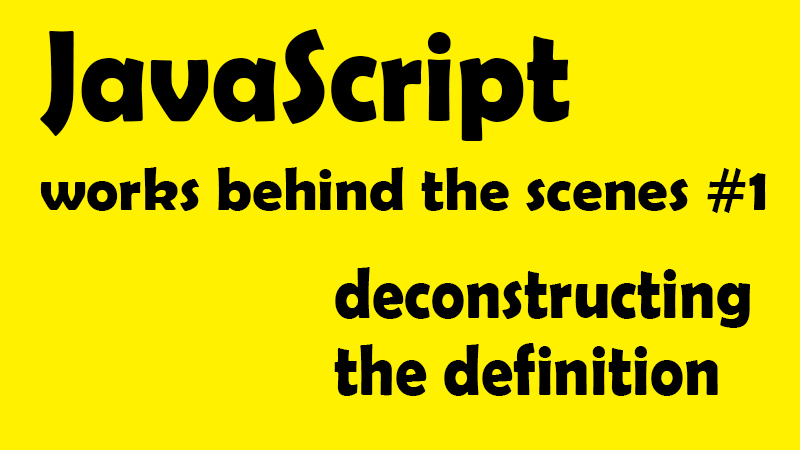

在結束 Alpha Camp 第二階段的課程後，也開始尋找其他線上的學習資源，而在眾多推薦下購買了 Jonas Schmedtmann 在 Udemy 上的課程-[The Complete JavaScript Course 2021: From Zero to Expert! ](https://www.udemy.com/course/the-complete-javascript-course/)想深入了解 JavaScript，接下來這一系列文章，將作為深入理解 JavaScript 運作原理的學習筆記，記下那些我未曾注意過的 JavaScript 細節。同時真的也要在開頭先大推 Jonas 的課，比喻相當好理解，也會同步示範各種不同的範例，真的非常划算！


<!-- <h1 style="text-align: center;">§ High-level 高階語言 §</h1> -->

## 📌 High-level 高階語言

首先，所有在電腦上執行的程式都需要記憶體或 CPU 這一類的硬體資源來讓他們得以運作，而像低階程式語言(例如：C 語言)需要手動管理存放資源，例如以 malloc() 跟 free() 等低階函式來控管記憶體權限，而高階語言(例如：JavaScript、Python)則因為抽象化(Abstraction)的特性，讓我們可以省去這些麻煩的指定步驟，也因為更接近人類的語言而更易於學習，但缺點就是程式效率永遠不如低階語言的快速。

**抽象化的意義**在 [MDN](https://developer.mozilla.org/zh-TW/docs/conflicting/Learn/JavaScript/Objects/Classes_in_JavaScript) 裡，有著這樣的解釋：

<div class="note default no-icon">為某個複雜東西建立簡單的模型，藉以代表其最重要的概念或特質，且該模型建立方式極易於搭配我們的程式設計用途。</div>

<!-- <h1 style="text-align: center;">§ Garbage-collected 回收機制 §</h1> -->

## 📌 Garbage-collected 回收機制

相較於低階語言必須手動管理記憶體，當 JavaScript 宣告變數時，就會自動分配空間並移除不再使用的物件以釋放儲存空間，而這就稱為回收機制（garbage-collected）。但這個自動化的回收流程，也往往會使開發人員產生不用理會「記憶體管理」的錯誤認知。

當我們談到程式語言，共有的記憶體生命週期認知，幾乎是一樣的。

1. 配置你的程式所需的記憶體空間
2. 使用配置到的記憶體空間(讀，寫)
3. 當不再使用時，釋放已被配置的記憶體空間

而除去第二點是確定的外(執行)，第一、第三點，在手動管理存放資源的低階語言是確定的，但是在高階語言，例如：Javascript 則是相對較不明確的，其中最大的問題就在於 ─ 如何找到「已不再被使用的記憶體配置空間」

**垃圾回收器(garbage collector)**

在 Javascript 中，有一個垃圾回收器(garbage collector)，他的工作就是追蹤記憶體的分配情形，來盡量達到「釋放」不再使用的記憶體空間任務。

但由於自動判斷不再使用記憶體空間這件事其實本質上是「不可判定的」，因為你要如何去確認他不會再被使用呢？而面對這樣的問題，就衍生出 Reference-counting garbage collection 作為演算法機制，也就是把「這個物件再也不會被使用」的較廣定義限縮為「沒有其他物件需要再訪問這個物件」也就是「相對」而言不被需要的認定方式來作為判斷依據，以將他視為可回收記憶體的垃圾。[MDN：Reference-counting garbage collection 範例](https://developer.mozilla.org/zh-TW/docs/Web/JavaScript/Memory_Management)

<!-- <h1 style="text-align: center;">§ Interpreted or just-in-time compiled §</h1> -->

## 📌 Interpreted or just-in-time compiled

從抽象語言轉換為機器語言的方法，而 JavaScript 是一個直譯語言，或更應該說是 Just-in-time compilation 即時編譯語言。

<!-- ( 延伸閱讀：【課程筆記】JS#2：JavaScript 引擎與 JavaScript 的運行環境 ─ 什麼？JavaScript 早就不只是直譯式語言了？！(feat:JavaScript Engine、JavaScript Runtime)） -->

<!-- <h1 style="text-align: center;">§ Multi-paradigm 多範式語言 §</h1> -->

## 📌 Multi-paradigm 多範式語言

和 C++語言一樣，JavaScript 語言是一個多範式語言，所謂**範式(paradigm)**是一種建構程式碼的方式和整體思維方式，取決於編碼的風格和技術。

其中 JavaScript 分別支援 Procedural programming(指令式程式設計)、Object-oriented programming (OOP)(物件導向程式設計)、Functional programming (FP)(函式程式設計)，除此之外，也可以總的分為 Imperative(命令式)或 Declarative(聲明式)。

而其實很多程式語言都只支援某一種類的程式設計(例如：OOP、PP、FP)，但對 Javascript 而言，卻是可以三種混合使用，可見 JavaScript 的靈活性與通用性。(所以讓我們可以想幹嘛就幹嘛 (大誤

<!-- <h1 style="text-align: center;">§ Prototype-based(基於原型) object-oriented (物件導向) §</h1> -->

## 📌 Prototype-based(基於原型) object-oriented (物件導向)

首先，幾乎除了原始值(primitive values)，例如：數字、字串以外，在 JavaScript 裡的所有元件都可以被視為一個物件(例如：陣列、物件、函式)，這也是為什麼他們可以被視為獨立元件，也可以互相被呼叫或使用。

而要介紹何謂基於原型 Prototype-based，我們可以以常見的陣列操作來比喻
例如陣列中的 push 方法，(為什麼用 push 就可以改變陣列?)
這是因為原型繼承（prototypal inheritance）

當我們創建一個陣列，我們是從一個叫做**陣列藍圖(array blueprint)**的模板基礎上創建陣列的，也就是所謂的原型（Prototype）(不然他怎麼可以隨隨便便生成陣列？對吧？)

而這樣的陣列藍圖，包含了所有陣列的方法，所以我們有了陣列後，可以輕鬆使用例如使用 array.push()、array.pull()等，去操作陣列，這是因為在使用陣列藍圖時，也就繼承（inherit）了藍圖上的操作方法(method)。但當然這只是簡單介紹，未來有機會會再深入這個議題去討論。

## 📌 First-class functions 一級函式

<!-- <h1 style="text-align: center;">§ First-class functions 一級函式 §</h1> -->

一級函式簡言之，也就是在該程式語言中，函式可以被視為「變數」被當作參數傳遞到另一個函式，或在另一個函式中被當作回傳值（return），或被當作值一般，被指定到一個變數當中，或也可以被放置在物件中。

而這樣的一級函式並不是只有 JavaScript 專屬的特性，但因為 JavaScript 有，所以 JavaScript hen 棒。而這也是多範式語言中的其中一項 Functional programming (FP)(函式程式設計)。

所謂函示可以被視為變數傳遞，讓我們看以下範例

範例：Modal

```javascript
const closeModal = () => {
  modal.classList.add("hidden");
  overlay.classList.add("hidden");
};
overlay.addEventListener("click", closeModal);
```

- 註 1：不是 closeModal() ，因為這樣一來 closeModal 會馬上被執行，而不是等到觸發"click"事件才被執行
- 註 2：傳入 closeModal，就是函式被作為一個單純的參數被傳入其中！

## 📌 Dynamic 動態類型語言

<!-- <h1 style="text-align: center;">§ Dynamic 動態類型語言 §</h1> -->

在 JavaScript 中，我們不會去指定資料類型(例如數字、字串等)，而是當 JavaScript 引擎執行代碼時自動辨認該資料類型，於是當我們為變數重新賦值時，資料類型又可以自動且輕易地轉換，這就是動態類型(dynamically-typed)的意義。簡言之，就是允許動態轉換。

範例：

```javascript
let x = 23;
let y = 19;
x = "Emily";
// x 從原本的 number，轉換為 string
```

而談到動態語言，相較於 JavaScript，其他需要手動定義類型的語言(例如：C、Java)則可以避免動態轉換所造成的各種錯誤，而這也是為什麼許多人說，JavaScript 應該強化類型的原因，因為很容易發生錯誤。而如果想要使用類型版的 JavaScript，可以學習 TypeScript

## 📌 Single-threaded 單執行序 Non-blocking event loop 非阻塞事件循環

<!-- <h1 style="text-align: center;">§ Single-threaded 單執行序 Non-blocking event loop 非阻塞事件循環 §</h1> -->

首先我們需要先了解 JavaScript 是單執行序，也就是一次只能執行一件事情，但若遇上需要同時間處理多項事件該怎麼辦呢？這就需要併發模型（concurrency model）來處理安排多工的情形。

而要達到這樣的效果，就需要事件循環（event loop）的幫助，也就是先在後台執行任務，並當執行完畢後，再將他們重新放回主線程上，這就是 JavaScript 的單線程非阻塞事件循環併發模型。(JavaScript's non-blocking event loop concurrency model with a single thread.)，說起來超饒口，只是先有一個基本印象，會在接下來逐一單元筆記整理。

這篇文章，只是做為整個 JavaScript 重點概觀的一個紀錄，接下來，將會依照課程的進行，依序記錄重點細節，如果你跟我依樣初學 JavaScript，真的很推薦在 Udemy 上購買 Jonas 的課 JavaScript zero to expert！雖然已經從初學 Javascript 到可以應用 node.js，但跟著每一小節學習，仍讓我看見之前從未注意到的細節，也學習了 Jonas 的編寫習慣，來讓自己成為更好的開發人員與學習者。

也歡迎跟著我對於 How javascript works behind the senes 筆記，一起逐步深入了解 Javascript 的原理喔！

**<center>JavaScript 深度旅遊系列<center>**

- [JS#1：JavaScript 運作原理 ─ 深入研究之前，先了解全局](https://emilycodeee.github.io/JS-1/)
- [JS#2：JavaScript 引擎與 JavaScript 的運行環境 ─ 什麼？JavaScript 早就不只是直譯式語言了？！](https://emilycodeee.github.io/JS-2/)
- [JS#3：JavaScript 的執行原理，Javascript 的執行環境 (Execution context) 與執行堆疊 (Call Stack)](https://emilycodeee.github.io/JS-3/)
- [JS#4：Javascript 的範疇/作用域（Scope）與範疇鏈 （Scope Chain）變數查找（variable lookup）](https://emilycodeee.github.io/JS-4/)
- [JS#5：優先認可 變數提升 Hoisting？暫時死區(Temporal Dead Zone) ─ const、let、var 的小祕密](https://emilycodeee.github.io/JS-5/)
