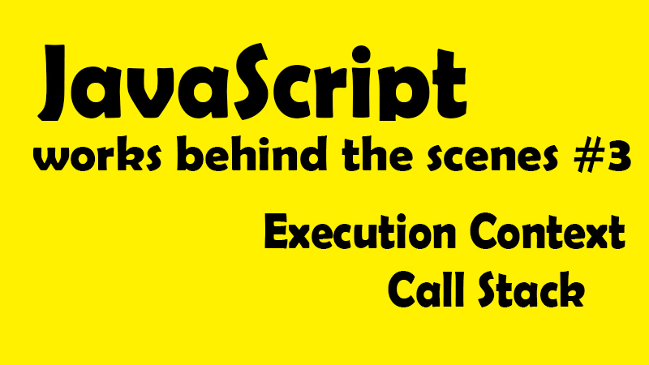

這一系列文章，是在 Udemy 上參與 Jonas Schmedtmann 的課程-[ The Complete JavaScript Course 2021: From Zero to Expert! ](https://www.udemy.com/course/the-complete-javascript-course/)所做的學習筆記，為了深入理解 JavaScript 運作原理，記下那些我未曾注意過的 JavaScript 細節。內容若有任何錯誤，歡迎留言交流指教！


---

在上篇，我們了解到 JavaScript 的運行環境及及不同程式碼編譯方法的差別後，現在讓我們更深入了解 JavaScript 的執行機制。

首先，在介紹 JavaScript 引擎時，我們知道主要是由兩個元件所組成：

1. Call Stack （堆疊棧）
2. Memory Heap （內存堆）

而我們知道所謂 Call Stack 是程式碼實際執行的地方，是透過執行環境（Execution Contexts）來執行程式碼。**那所以，執行環境到底是什麼、又是如何運作的呢？**

讓我們簡單複習一下 JavaScript 的即時編譯過程 ─
JavaScript 原始碼進入引擎 → 解析(Parsing) → 轉為數據結構，組成抽象語法樹(AST) → 編譯(Compilation) → AST 轉換為 machine code 並立即被執行【Execution Contexts】 → program running

現在，假設我們的程式碼已經完成了編譯(Compilation)，進入執行階段 ─ 首先會為頂層程式碼（Top Level Code）創建所謂全域執行環境，也就是會首先執行函式以外的所有程式碼，（因為函式只有在被調用時才會被執行，所以很合理吧？）

\*頂層程式碼（Top Level Code）就是最外層，也就是不存在函式中的程式碼。

```javascript
//全域變數
const name = "emily";

//expression function
const first = () => {
  let a = 1;
  const b = second();
  a = a + b;
  return a;
};

//declaration function
function second() {
  var c = 2;
  return;
}
```

首先，從這段程式碼中，我們可以看到 name、first 函式、second 函式都屬於頂層程式碼，只是函式需要等候被調用才會執行，所以在這個範例的全域執行環境中，只有 name 正在被執行。

**現在，問題繞回來了，所以執行環境到底是什麼啊？**

## 📌 Javascript 的執行環境 (Execution context)？<a id="jump_1"></a>

也被稱為執行上下文、執行背景空間、執行情境。簡單來說，執行環境就是一個**對應於當前所需要被執行的部分程式碼而準備的環境**，而在這個環境中儲存了所有執行這部份程式碼所需要的一切資訊，例如將區域變數或參數傳入函式中。換言之，也就是 JavaScript 的程式碼永遠只在執行環境中被執行。

白話一點比喻，就像是你去必勝客買一份獨享披薩套餐，你領到餐點時，袋子裡面會有紙巾、叉子、披薩、還有其他醬料等，妳想吃披薩，要透過這個袋子裡的物件才能享用它。而這一整個套餐袋子就是執行環境(Execution Context)，裏頭的叉子、紙巾、醬料則是吃披薩所需要的工具，而披薩就是要執行的程式碼。

### 所以執行環境可以有很多個囉？是、也不是。

**◆ 全域執行環境 (Global Execution Context) 只會有一個！**
全域執行環境也是預設環境（Default Context），無論 Javascript 的項目有多大，都只會有一個全域執行環境，會在進入執行程序時，首先被創建出來，也就是為頂層程式碼所創建第一環境。而在上述的例子中，全域執行環境裡的對象就是 name、first 函式、second 函式（但記得，函式還沒被執行，因為沒被調用。）

**◆ 函式執行環境 （Function Execution Context）個別函式專屬的執行環境**
記得先前提到，Javascript 永遠都會在 EC 內被執行嗎？也就是說當函式被調用時（invoke）將會各別為該函式建立專屬的執行環境，也就是說有多少個函式要被執行，就有多少個函式執行環境。

而以上所有 EC 的集合，就組成了先前提到的 Call Stack (執行堆疊、堆疊棧)。並同時，當所有以上執行環境都執行完畢後，JavaScript 引擎還是持續保持待機狀態，等待回調函式（callback function）例如滑鼠事件所觸發的函式抵達，而這中間會經過事件回調（Event Loop）的協調機制進行。

大致了解後面的拼圖後，現在我們再回到執行環境 (Execution Context) 中細細拆解。**執行程式碼主要分為兩個階段，創建環境與執行階段(creation & execution phase)。**

## 📌 創建執行環境 ( creation phase ) ─ 執行環境裡到底有什麼？<a id="jump_2"></a>

### 1.變數環境 Variable Environment

let,const,var 變數宣告
Function 聲明
arguments object 參數物件

其中參數物件包含所有傳入該函式的一切參數。而顧名思義，函式執行環境是為了特定函式被執行而建立的，這也就表示當執行結束，這個變數環境也就結束了。

### 2.建立外部環境(Outer Environment) ─ 範疇鏈 Scope Chain

首先，全域執行環境相當單純，當然就沒有所謂 Outer Environment，因為他本身就是最外部了。所以此項主角肯定是函式執行環境！

函式理所當然可以訪問內部的一切變數（這沒問題），但同時也因為**範圍鏈（Scope Chain）的作用**而讓函式可以訪問 **「外部變數」，也就是創造了外部環境**。

範疇鏈的意思就是所有的內部作用區域，都可以訪問他們的外部作用區域，也就是子作用域可以往父層作用域查找所需要的變數。例如 function a 包在 function b 裡，function b 就是 function a 的外部環境。詳細部份會在後續獨立筆記中記錄。

> ｂｂｂ
> ｂａｂ
> ｂｂｂ

### 3.特殊變數 this keyword

this 會在執行環境創建時，自然被生成。

\*注意細節：箭頭函式 Arrow 沒有 this、也不會有參數物件。但同樣的，函式執行環境會因為範疇鏈的作用，而擁有外部環境，所以雖然箭頭函式本身不具有 this 與參數物件，但他仍可以使用距離最近的父層常規函式的 this 與參數物件。這部份也會在 this 獨立筆記中記錄。

現在，統合以上基礎常識，讓我們回到範例來拆解個別執行環境

```javascript
const name = "emily";

const first = () => {
  let a = 1;
  const b = second(7, 9);
  a = a + b;
  return a;
};

function second() {
  var c = 2;
  return;
}
const x = first();
```

以下是創建出來的個別執行環境：全域執行環境(預設創建)、與兩個函式執行環境

|                                        Global                                        |                  first()                   |             secons()             |
| :----------------------------------------------------------------------------------: | :----------------------------------------: | :------------------------------: |
| name = 'emily' <br >first = (function) <br>second = (function) <br >x = (未知)\*註一 | a = 1 <br >b = (未知) <br >需執行 second() | c = 2<br >參數 \[7,9]<br >\*註二 |

註一：嚴格來說，在創建執行環境階段時，數值都是未能得知的，因為需要經過執行才知道，所以在這裡寫下未知的值，其實是有瑕疵的，只是因為要模擬執行環境的建立過程，先不談到執行，所以才先這樣寫下。

註二：這裡參數傳入的是陣列\[7,9]，而這在常規函式是允許的，但在箭頭函式則是不允許的。

透過以上的範例可以看到 EC 創建的邏輯，現在讓我們想像，如果有上百個 EC，那 JS 引擎要如何追蹤執行先後順序？而這就是執行堆疊（Call Stack）的任務了！

## 📌 建立執行環境 ( creation phase )<a id="jump_3"></a>

超白話來說，執行堆疊就是堆疊執行環境的地方，用來追蹤我們目前所在程式碼的位置，所以最上層的執行環境 EC，就是我們目前正在執行的程式碼片段，而當執行完畢，該執行環境就會被從執行堆疊中彈出。

現在讓我們回到範例中，解釋執行堆疊的運作過程。

```javascript
const name = "emily";

const first = () => {
  let a = 1;
  const b = second(7, 9);
  a = a + b;
  return a;
};

function second() {
  var c = 2;
  return;
}
const x = first();
```

**開始執行（模擬 Call Stack 變化）**：
| 建立預設，全域執行環境 | X 須執行 first()，於是堆疊 first EC | first()執行到變數 b，需要執行 second()，故堆疊 second EC |second 執行完彈出，繼續回到 first|first 執行完彈出，X 終於被賦值 |
|:----------:|:-------------:|:------:|:------:|:------:|
| | | second() | | |
| | first()|first() |first() | |
| Global EC | Global EC | Global EC |Global EC |Global EC |

**流程解釋：**

1. 首先頂層代碼需要首先被執行，所以創建了全域執行環境，並被放入執行堆疊中。
2. 當程式碼跑到 X，調用 first 函式，first 專屬的執行環境就會被放入執行堆疊中，開始執行
3. 而當 first 函式中執行到第 2 行 const b = second(7,9) 時，需要調用 second 函式，second 專屬的執行環境就會從 first 上方被堆疊上去，而 second 函式開始執行(此時已經沒有需要堆疊的執行環境了)
4. second 函式執行完後該執行環境彈出，將值回傳給 first 的 b 變數，此時 first 函式終於回到原本優先執行的位子，並開始執行，執行完後彈出
5. 最後 X 得到回傳值，終於被賦值完畢。執行堆疊回到原本只有全域執行環境的狀態。

最後，執行雖然乍看結束了，但目前執行程序仍然會保持在全域執行環境狀態，直到他真正被結束的時候，也就是當我們關閉瀏覽器或視窗時，在那時候就會連全域執行環境都從執行堆疊中彈出。

這樣一路看下來，我們會很清楚知道，執行堆疊對於單執行序的 JavaScript 作用的重點核心，就在於**追蹤執行**，因為沒有了執行堆疊，我們就無法追蹤現在程式馬執行到哪裡，或應該回到哪裡。

**執行堆疊就像是 JS 的地圖，讓 JS 執行順序不會迷失。**以上就是執行環境、執行堆疊的工作原理。內容若有任何錯誤，歡迎留言交流指教！

接下來，讓我們進一步了解範圍鏈 (Scope Chain)，也就是函式執行環境中，所謂的外部環境到底是什麼意思。

**<center>JavaScript 深度旅遊系列<center>**

[JS#1：JavaScript 運作原理 ─ 深入研究之前，先了解全局](https://emilycodeee.github.io/JS-1/)
[JS#2：JavaScript 引擎與 JavaScript 的運行環境 ─ 什麼？JavaScript 早就不只是直譯式語言了？！](https://emilycodeee.github.io/JS-2/)
[JS#3：JavaScript 的執行原理，Javascript 的執行環境 (Execution context) 與執行堆疊 (Call Stack)](https://emilycodeee.github.io/JS-3/)
[JS#4：Javascript 的範疇/作用域（Scope）與範疇鏈 （Scope Chain）變數查找（variable lookup）](https://emilycodeee.github.io/JS-4/)
[JS#5：優先認可 變數提升 Hoisting？暫時死區(Temporal Dead Zone) ─ const、let、var 的小祕密](https://emilycodeee.github.io/JS-5/)
