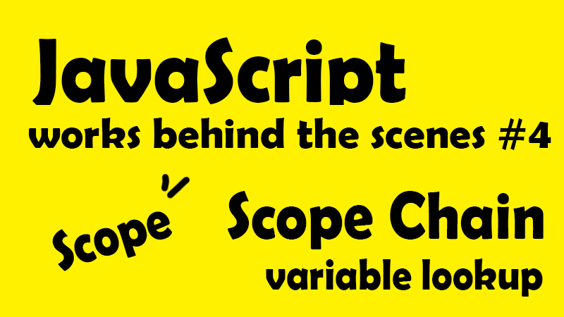

這一系列文章，是在 Udemy 上參與 Jonas Schmedtmann 的課程-[ The Complete JavaScript Course 2021: From Zero to Expert! ](https://www.udemy.com/course/the-complete-javascript-course/)所做的學習筆記，為了深入理解 JavaScript 運作原理，記下那些我未曾注意過的 JavaScript 細節。內容若有任何錯誤，歡迎留言交流指教！



- [了解範疇（Scope）的概念 (What is Scope?)](#jump_1)
- [範疇 Scope－全域範疇 Global Scope、區域範疇 Local Scope](#jump_2)
- [範疇鏈 Scope Chain](#jump_3)
- [範疇鏈 Scope Chain V.S 執行堆疊 call stack](#jump_4)
- [本章重點整理](#jump_5)



---

談完執行環境與執行堆疊，讓我們繼續向下探索。(前篇：執行原理與執行堆疊 Call Stack)

上一篇談到執行環境時，我們看到創建執行環境階段，居然還有著所謂建立「外部環境」，讓函式可以訪問「外部變數」，而這就要談到範疇鏈（Scope Chain)。在這篇筆記中，我們要深入了解什麼是範疇 Scope 以及範疇鏈 Scope Chain。

先讓我們複習一下，每一個執行環境，都擁有：

- 環境變數 (variable environment)
- 外部環境（透過 Scope Chain 建立）
- this 關鍵字 (this keyword)

要談到範疇鏈（Scope Chain）之前，先讓我們了解範疇（Scope）的概念，包含以下

## 📌 了解範疇（Scope）的概念？<a id="jump_1"></a>

##### ◆ 作用範疇 Scoping：

JS 引擎用來管理我們的變數如何組織及如何被訪問的機制，也就是說現行範疇是在判斷 ─ 變數存在於哪裡、可以在哪裡訪問特定變數，在哪裡則不行。

##### ◆ 語彙作用範疇 Lexical Scoping：

白話來說，**就是變數被組織及訪問的機制，完全由被放置於函式的位置或程式碼中區塊(block)位置所決定。**例如，func A 包著 func B，裡面的 func B 可以拿到外面 func A 的變數，但只能由內而外拿，外面不能拿裡面的。或兩個平行獨立的 func C 與 func D 不能互相訪問。

簡言之，變數的作用範疇，取決於我們編寫程式碼的位置。

##### ◆ 範疇 Scope：

Scope 是指編譯器或 JavaScript 引擎藉由識別字名稱（identifier name）查找變數的一組規則。簡單來說，**可以將範疇 Scope 視為是聲明特定變數時，該變數所存在的空間或環境。**

例如，以 function 來舉例，我們知道 function 的變數環境就是 function 本身，如此一來 function 的變數環境(variable environment)與 function 的範疇(scope)好像其實是同一件事？

其實以函式而言，基本上是一樣的。晚點看看下方範例，可以了解為什麼這麼說。

##### ◆ 變數範疇 Scope of a variable：

變數的作用範疇基本上就是整個變數所屬的區域，也可以解釋為說特定變數可以被訪問的範疇。

統合以上切分範疇 Scope 的基本概念，雖然好像可以直接用 Scope 的定義解釋全部，但如果仔細切分開來，其實會發現仍然有不同的細節，例如範疇(Scope)與變數範疇(Scope of a variable)就代表著完全不同的事。

雖然可能看起來還是很像一分鐘有六十秒經過的廢話，但看過接下來的例子，就能更明白這些細節所隱含的意義。現在讓我們正式 ZOOM-IN!!

## 📌 範疇 Scope 分為兩種：全域範疇 Global Scope、區域範疇 Local Scope<a id="jump_2"></a>

範疇 Scope 分為兩種：全域範疇 Global Scope、區域範疇 Local Scope，其中區域範疇又分為函式範疇 Function Scope、區塊範疇 Block Scope

首先讓我們帶著對範疇的基本理解再往下看 ─
**範疇 Scope 就是我們在程式碼中聲明變數的位置，決定著我們的變數可以在什麼狀態下被訪問。**而別忘了函式也是變數之一，因為歸根究底，函式也是一個值(Value)存放在變數當中。

##### ◆ 全域範疇 Global Scope

首先，全域當然就代表著我們的頂層程式碼（Top Level Code），也就是所有被聲明在函式或區塊(block)以外的程式碼，都屬於全域範疇。

這些全域變數（Global variable），可以在程式碼中的任何地方被訪問，套一句 Lucy 說的「I am everywhere」

範例：

```javascript
const name = "emily";
const job = "freelancer";
const year = 1993;
```

##### ◆ 區域範疇 Local Scope ─ 函式範疇 Function Scope、區塊範疇 Block Scope

**★ 函式範疇 Function Scope**

被聲明在函式內部的所有變數都只能在函式內部被訪問，這也稱為區域範疇（對比全域範疇），或更精準地說函式範疇。也可以白話一點的說，函式內部的變數，只活在函式內，是不能在函式外被訪問的。

＊而基本上，函式範疇與函式變數環境是一樣的，但我們還是要稱它為函式範疇，因為區塊程式也會有自己的區塊範疇，所以還是要切分開來不同意義。

範例：

```javascript
function calcAge(birthday) {
  const now = 2037;
  const age = now - birthday;
  return age;
}
console.log(now);
// ReferenceError
```

以上述範例而言，now 變數為 2037，在函式中可以取用它進行計算，但是在函式以外，當我們試圖 console.log(now)時，JS 會試圖在全域範疇中尋找 now 變數，但因為它在函式範疇內，所以找不到 now，而出現錯誤。

所有函式聲明都有自己的函式範疇，不管聲明函式(function declarations)、表述式函式(function expressions)、或箭頭函式(Arrow functions)都是。並且傳統上只有函式會創建自己的範疇，但到了 ES6，區塊也有自己的作用範疇。

**★ 區塊範疇 Block Scope**

區塊指得是**大括號{}**(curly braces)裡的一切，例如 if{}、for{}，就像函式一樣，區塊內(block)，也就是大括號內的變數都只能在區塊內被訪問。

而其中最大的分別在於，區塊變數只適用於 let 或 const，也就是說 let 與 const 只限用於他們所存放的區塊內，於是我們說 **let 與 const 屬於區塊範疇** 。而 **var 則屬於函式範疇**，因此可以在區塊外、函式範疇內被訪問，var 界定的範疇可以在下方範例中更深認識。

＊這也就可以解釋，為什麼 ES5 以前我們只有全域範疇與函式範疇，因為在 ES5 以前，是使用 var 聲明變數，當時只關注於函式，而沒有特別區分出區塊(block)。沒錯就是很單純的將它忽略 XD。**而從 ES6 開始，在嚴格模式"strict"下，函式也等同於區塊範疇**，於此，我們應該永遠在嚴格模式下開發，以避免錯誤。

範例：

```javascript
if (year >= 1981 && year <= 1996) {
  const millenial = true;
  const food = "avocado toast";
}
console.log(millenial);
//ReferenceError
```

\*區塊(block)內聲明的函式，只能在區塊內被訪問。
接下來我們來談談 範疇鏈 Scope Chain

## 📌 範疇鏈 Scope Chain<a id="jump_3"></a>

範疇鏈的意思就是所有的內部函式，都可以訪問他們的外部環境來取得所需要的變數，這個查找步驟也稱作**變數查找(variable lookup)**。而範疇鏈只能由內而外，不能由外而內。讓我們看看以下範例：

```javascript
const myName = "emily";
function first() {
  const age = 30;

  //block scope
  if (age >= 30) {
    const decade = 3;
    var millennial = true;
  }

  function second() {
    const jib = "freelancer";
    console.log(`${myName} is a ${age}-year old ${job}`);
    //print emily is a 30-year old freelancer
  }
  second();
}
first();
```

由上述例子中，讓我們想想 emily is a 30-year old freelancer 字串是怎麼被打印出來的，以下表格為各個 scope 內的涵蓋變數：
| Global Scope|first() scope|if block scope |second() scope|
|:----------:|:-------------:|:------:|:------:|
|myName="emily" | age = 30| decade = 3 | job = "freelancer"|
| | millennial = true|age = 30|age = 30 |
| | myName ="emily" | millennial = true |millennial = true |
|||myName ="emily"|myName ="emily"|

scope chain 只能由子範疇向父範疇查找，而平行的範疇也不能相通。

讓我們先記得上面這句話，然後把注意力放在 console.log(`${myName} is a ${age}-year old ${job}`)上，一起來看看字串是如何被打印出來的。

首先 myName、age 並乍看並不是當前函式變數，但因為 scope chain 所以我們可以向外部(也就是父層)去查找我們所需要的變數，如此查到 func first 內的 age 及最外層全域變數的 myName。

＊剛剛我們模擬的向外搜尋機制，就是所謂的 scope chain，而這個查找過程也稱為變數查找(variable lookup)。但有一點特別注意是，平行間的區域範疇不能彼此互通，也就是 if block scope 與 second() scope 是不能互相訪問變數的，因為他們的 scope 是各自獨立沒有重疊，而這也就是最一開始提到的語彙作用範疇 Lexical Scoping(也就是 ─ 你的程式碼究竟是寫在哪裡。)

另外，在 if block scope，我們看到用 var 聲明的 millennial 居然能掙脫 block 被 fucn first 納入範疇，那是因為 var 聲明變數不受 block scope 管制，而屬於最近的、也就是屬於 first 函式範疇。也就因此可以被內部的 second 函式所訪問。

但因為用 const 聲明的 decade 變數，const 屬於 block scope，所以當然它只能在該 block 裡作用。

## 📌 範疇鏈 the Scope Chain V.S 執行堆疊 Call Stack<a id="jump_4"></a>

現在我們了解了範疇鏈 Scope Chain，讓我們回想一下上一篇的執行堆疊(call stack)，他們兩個有什麼互相影響關係嗎？**答案是沒有！範疇是界定變數可作用的範圍，與函式調用的執行順序沒有關聯！**

## 📌 本章重點整理<a id="jump_5"></a>



- 範疇（Scope Chain）永遠都在問的問題是「這個變數到底能夠作用在哪裡」或者「我們可以在哪裡訪問該變數」、「在哪裡不行」
- 範疇細分為三種類型：全域範疇、（函式範疇、區塊範疇）＝＞區域範疇
- 只有 let、const 屬於區域範疇變數，var 聲明的變數將自動結束於最近的函示範圍內
- 在 js 我們有所謂的詞彙範疇(Lexical Scoping)，也就是用來規範我們訪問函式時的判斷準則來自於，該變數在函式或區塊中的位置。也就是 ─ 你的程式碼究竟是寫在哪裡。
- 範疇鏈的意思就是所有的內部作用域，都可以訪問他們的外部作用區域，也就是子作用域可以往父層作用域查找所需變數。
- 承上，當變數不在現行函式內，引擎會往上(往外)範疇鏈作用尋找(只能往父層、不能往平層)，這就稱為變數查找。
- 變數查找為單執行序，外部變數不能往內部變數查找，只有內部可以往上(往父層)查找。
- 而這也可以說是，我們可以在一定範圍內(例如最內層的函示作用域)，可以取用的變數，等同於是所有父層作用域加總的變量環境。



最後重點，範疇鏈(scope chain)與執行堆疊(call stack)的順序無關。
內容若有任何錯誤，歡迎留言交流指教！

**<center>JavaScript 深度旅遊系列<center>**

[JS#1：JavaScript 運作原理 ─ 深入研究之前，先了解全局](https://emilycodeee.github.io/JS-1/)
[JS#2：JavaScript 引擎與 JavaScript 的運行環境 ─ 什麼？JavaScript 早就不只是直譯式語言了？！](https://emilycodeee.github.io/JS-2/)
[JS#3：JavaScript 的執行原理，Javascript 的執行環境 (Execution context) 與執行堆疊 (Call Stack)](https://emilycodeee.github.io/JS-3/)
[JS#4：Javascript 的範疇/作用域（Scope）與範疇鏈 （Scope Chain）變數查找（variable lookup）](https://emilycodeee.github.io/JS-4/)
[JS#5：優先認可 變數提升 Hoisting？暫時死區(Temporal Dead Zone) ─ const、let、var 的小祕密](https://emilycodeee.github.io/JS-5/)
