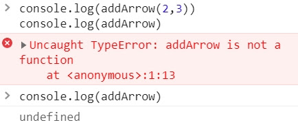

這一系列文章，是在 Udemy 上參與 Jonas Schmedtmann 的課程-[ The Complete JavaScript Course 2021: From Zero to Expert! ](https://www.udemy.com/course/the-complete-javascript-course/)所做的學習筆記，為了深入理解 JavaScript 運作原理，記下那些我未曾注意過的 JavaScript 細節。內容若有任何錯誤，歡迎留言交流指教！

---

從執行環境、執行堆疊到範疇鍊，我們的 Javascript 深度旅行好像已經走了很遠，現在讓我們談談在 JavaScript 很容易被誤會的概念 ─ 提升 Hoisting

從執行環境中，我們知道執行環境(Execution Context)分別為變數環境、範疇鏈、this 關鍵字。在上一篇談完範疇鏈後，現在是時候讓我們進一步看看變數環境有關的細節 ─**變數是如何在 JavaScript 被創建的？而這就會馬上破題談到提升 Hoisting！**

## 📌 優先認可 提升 Hoisting？<a id="jump_1"></a>

提升 Hoisting 的概念，簡單來說就是優先認可，也就是讓某些類型的變數<u>**可以在其被聲明之前，在該作用範疇中被使用。**<u>

或許有些人的解釋是，變量被神奇的提升或被移到範疇的頂部。表面上看起來真的像是如此沒錯，但其實它的原理並不是這樣的！

從原理來看，JS 引擎是在執行前先對所有聲明變數做了掃描，而這個階段也就是先前提到的**創建執行環境(execution context)的階段 ─ 創建階段(creation phase)**，在這個階段被找到的每個變數，會被建立新的屬性存放在變數環境的物件中，而這就是 hoisting 真正作用的過程。

## 📌 不同聲明方法下的 Hoisting 差別<a id="jump_2"></a>

<!-- -	是否提升Hoisted?	初始值	範疇
Function Declaration(函式陳述句)	" O "	函式本身	區塊範疇
var聲明變數	" O "	undefined	函式範疇
let const聲明變數	" X.. "	未初始化，TDZ	區塊範疇
Function Expression
(函式表述式)、箭頭函式	取決於使用什麼變數	var	const/let -->

Hoisting 並非在所有聲明屬性中都有相同作用，現在讓我們以下面的表格來看看差別如何以及為什麼會如此！
| -| 是否提升 Hoisted?| 初始值 | 範疇 |
|:----------:|:-------------:|:------:|:------:|
|Function Declaration(函式陳述句) | " O "| 函式本身 | 區塊範疇|
|var 聲明變數 | " O "|undefined |函式範疇 |
|let const 聲明變數 |" X.. " | 未初始化，TDZ |區塊範疇 |
|Function Expression(函式表述式)、箭頭函式|取決於使用什麼變數|var|const/let|

##### ◆ 函式陳述句 (Function Declaration)

會提升，而初始值就是該函式本身。這也說明為什麼我們可以在函式被聲明之前，調用該函式。因為函式陳述句在執行開始前，就「已經」被儲存於變數環境物件中。

\*只有在嚴格模式(strict mode)下範疇才僅限於區塊範疇，若是在鬆散模式則屬於函式範疇。

##### ◆ var 聲明變數

會提升，初始值為 undefined。一般而言，我們在聲明變數前使用變數，若不是被跳錯誤，就是取得變數值，怎麼都不會出現 undefined，為什麼 var 卻變成 undefined??

其實這是 JavaScript 中的一個 bug，也是為什麼在現行 JavaScript 我們幾乎不使用 var 的原因。

##### ◆ let/const 聲明變數

嚴格來說，是有提升的，但因為他們的值被設定為尚未初始化(uninitialized)，也就沒有值(value)，所以實際上的提升就像是完全沒有發生一樣。>會報錯顯示 cannot access before initialization。

而我們也會稱這些變數被放置在暫時死區(Temporal Dead Zone - TDZ)，也就是說從該變數存在的範疇起點到該變數被聲明的位置之前沒有辦法被訪問，簡單來說就是還沒被聲明所以不能被訪問。

如果在聲明之前嘗試訪問 let 或 const 變數，我們就會得到錯誤！還記得先前說的 let、const 屬於區塊範疇嗎？而這些種種因素加在一起，控制變數可以被呼叫的區間，也就是為什麼現行 JavaScript 會引入 let 和 const，同時不使用 var 的原因 (再次看向樓上怪怪的 undefined...)

##### ◆ Function Expression 函式表達式與箭頭函式

取決於聲明函式時使用的是什麼方法(var 或 const/let)，如果使用 var，則在函式被聲明前會被提升為 undefined，如果使用 const/let，則同上，在聲明前調用會存在暫時死區(TDZ)的問題。

## 📌 暫時死區(Temporal Dead Zone)<a id="jump_3"></a>

暫時死區聽起來好像很 ROCK! 到底什麼意思？
範例：

```javascript
const myName = "Emily";

if (myName === "Emily") {
  console.log(`Emily is a ${job}`);
  const age = 2037 - 1989;
  console.log(aga);
  const job = "freelancer";
  console.log(x);
}

console.log(`Emily is a ${job}`);
```

從 if 區塊第一行到 const 聲明 job 變數前，都屬於 job 變數的 TDZ，所以若是呼叫 job 會抱錯告訴你該變數還沒被初始化。(例圖)


```javascript
console.log(x);
```

而若我們連聲明變數都沒有，卻進行呼叫，則會出現 is no defined 未定義


現在讓我們把兩件事情統整起來看，事實上 job 雖然暫時處於 TDZ 狀態，但 JS 引擎知道 job 變數始終會被初始化，**是因為 JS 引擎已經事先掃描過完整代碼**，而他只是在變量環境的創建階段將 job 設定為尚未初始化。

於是當執行到達變數聲明那一行時，變數就會被從 TDZ 中移除，也就是說可以開始使用了。

總的來說，let、const 都有他們自己的暫時死區(TDZ)，也就是從範疇的第一行到他們真正被聲明的那一行。

有了觀念後，讓我們來看看範例吧！

##### ◆ 變數 Hoisting 範例

```javascript
console.log(me);
console.log(gender);

var me = "emily";
let gender = "female";
const year = 1993;
```


被 var 聲明的變數打印出 undefined，而 gender 則是出現未定義狀態。

##### ◆ 函式 Hoisting 範例

```javascript
console.log(addDecl(2, 3));
console.log(addExpr(2, 3));
//ex:var
console.log(addArrow(2, 3));
console.log(addArrow);

//Function Declaration
function addDecl(a, b) {
  return a + b;
}

//Function Expression
const addExpr = function (a, b) {
  return a + b;
};

//Arrow Function
var addArrow = (a, b) => a + b;
```


Function Declaration(函式陳述句)因為提升機制 hoisting，於是可以被正常調用，而 Function Expression(函式表述式)則因為使用 const 變數聲明處於未初始化階段，也就是位於 TDZ 狀態中。



var 聲明的箭頭函式，被提升為 undefined，而因為函式本身已經變成 undefined，於是在調用 addArrow(2,3)時，就像是調用了 undefined(2,3)，所以報錯會顯示 addArrow 並不是 function

##### ◆ 神秘的 var undefined 陷阱

這裡我們設定一個刪除購物車的函式，邏輯設定是「當商品總數為 0 時」執行刪除購物車。注意，因為 0 布林值為 fales，所以假設我們的設定邏輯是，當 numPruducts=0，也就是呈現 false 時，就執行 deleShopingCart()

```javascript
console.log(numPruducts);
//print undefined
if (!numPruducts) deleShopingCart();

var numPruducts = 10;

function deleShopingCart() {
  console.log("all products deleted");
}
```


而在這例子中，購物車被刪除了！！但明明 numPruducts 裡有 10 件商品，**明明不為 0**卻達到執行條件了？**因為 var 變數 Hoisting 的機制，在 var 變數聲明前被初始為 undefined，也就是 false 所以翻轉也就造成執行條件成立。**

當然這是一個迷你的例子，所以糾錯容易，試著想像如果今天有幾百幾千行程式碼，要找到他應該會很崩潰吧？而這就是為什麼避免使用 var 的原因。

讀到這裡，為什麼 const/let 被引入、為什麼要有 TDZ？你有答案了嗎？

## 📌 為什麼要有 TDZ(Temporal Dead Zone )？<a id="jump_4"></a>

如果還有點不確定，讓我們在想想令人混淆的 var....

沒錯，TDZ 被引入的原因，首要就是為了**避免錯誤及抓取錯誤**，因為當我們使用尚未被聲明的變數而產生 undefined 時，可能會導致嚴重的錯誤，而更可怕的是你有可能會找不到他(或應該說很難找到他)，**避免錯誤最好的方法，就是讓錯誤變得顯而易見，而 TDZ 就是因為這個而存在，因為他會報錯！**

第二、讓 const 照他們被設定的規則來工作 ─ 因為 const 不能被重新賦值，所以不可能先將 const 變數設定為 undefined，才又將他們分配實際值，TDZ 機制讓 const 只有在被賦值時才能被使用。

## 📌 為什麼要有提升 Hoisting？<a id="jump_5"></a>

起初 JavaScript 的創造者實施 Hoisting 是為了讓函式陳述句(Function Statement/Function Declaration)，在被聲明之前就允許被調用，而這其實是程式語言技術中不可或缺的方法，就像解決相互遞迴的問題(mutual resursion)，而也有人認為提升的機制，讓程式碼更具可讀性。
[Hoisting in JavaScript and why we need](https://medium.com/weekly-webtips/hoisting-in-javascript-and-why-we-need-c99d1469de44)

當然，在當時的時空背景提升 hoisting 也適用於 var 聲明，因為在當時那是 Hoisting 唯一可以執行的方式，所以嚴格來說 var 變數的提升有點像是整個機制下的副產品，在那時候簡單把 var 變數提升成 undefined 好像是不錯的折衷方式，但很明顯現在不是 XD，所以才有了 let/const 的引入

## 📌 再多一點 take away：var 的小秘密<a id="jump_6"></a>

```javascript
var x = 1;
let y = 2;
const z = 3;
```


window 是 JavaScript 的全域物件，在這裡可以看到各式各樣的操作函式，而重要的是在這裡會發現居然有 var 聲明的 x 變數屬性，但卻看不見 z、y。

現在知道了吧！用 const、let 聲明變數不會在 window 物件裡被創建屬性，但 var 會。

以上，其實 hoisting 真是個有趣的小東西呀

**<center>JavaScript 深度旅遊系列<center>**

- [JS#1：JavaScript 運作原理 ─ 深入研究之前，先了解全局](https://emilycodeee.github.io/JS-1/)
- [JS#2：JavaScript 引擎與 JavaScript 的運行環境 ─ 什麼？JavaScript 早就不只是直譯式語言了？！](https://emilycodeee.github.io/JS-2/)
- [JS#3：JavaScript 的執行原理，Javascript 的執行環境 (Execution context) 與執行堆疊 (Call Stack)](https://emilycodeee.github.io/JS-3/)
- [JS#4：Javascript 的範疇/作用域（Scope）與範疇鏈 （Scope Chain）變數查找（variable lookup）](https://emilycodeee.github.io/JS-4/)
- [JS#5：優先認可 變數提升 Hoisting？暫時死區(Temporal Dead Zone) ─ const、let、var 的小祕密](https://emilycodeee.github.io/JS-5/)
