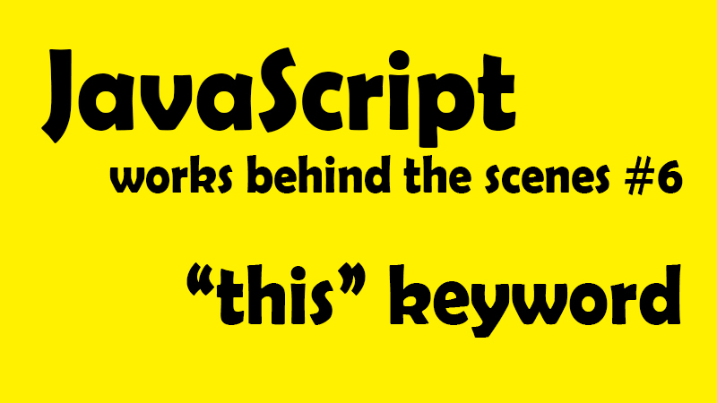

這一系列文章，是在 Udemy 上參與 Jonas Schmedtmann 的課程-[ The Complete JavaScript Course 2021: From Zero to Expert! ](https://www.udemy.com/course/the-complete-javascript-course/)所做的學習筆記，為了深入理解 JavaScript 運作原理，記下那些我未曾注意過的 JavaScript 細節。內容若有任何錯誤，歡迎留言交流指教！

---

是時候來看看 this 這個小東西了！之前在初學 JavaScript 時(現在也沒多資深)，時有耳聞 this 關鍵字是一個 tricky 的小東西，回頭看我們已經逐步建立起還不錯的觀念，現在是時候讓我們迎頭趕上 this 變數了。

## 📌 this 變數是什麼？what is this keyword？<a id="jump_1"></a>

this 關鍵字，或稱 this 變數，是一個特殊變數，建立於每一個執行環境(execution context)，或也可以說每一個函式，並 this 變數的值永遠取該函式的調用者。而且這個值不是靜態的，也就是說這個值是會變動的，所以才說他 tricky。

this 的值取決於該函示被調用的方式，並且只有該函示確實被調用時才會被賦值。先別慌問題不大，讓我們繼續看下去！

## 📌 this 變數被調用的四種方式？<a id="jump_2"></a>

◆ 方法 method ─
this 值指向調用該方法的整個物件。簡單來說，當我們調用一個方法時，裡面的 this 變數會簡單指向該對象，換句話說，就是指向 **「誰」在調用方法**。

```javascript
const emily = {
name = 'emily',
year = 1993,
calcAge:function(){
return 2037 - this.year
}
}
emily.calcAge()
```

範例說明：在上述例子中，calcAge 就是一個方法，看到最後一行，emily.calcAge()，應該看做是 emily 調用了 calcAge()，所以 this 自然指向調用者 emily 的所有屬性，所以 this.year 就取得了 1993。

##### ◆ 單純調用函式 function ─

當我們單純調用 function，也就沒有調用對象，所以不能視為是方法，而當然也就因此「沒有對象」可以賦值，於是 this 就等於 undefined。 \*但這只對嚴格模式下有效，若是鬆散狀態，則 this 會指向全域物件，例如瀏覽器的全域物件就會是 window。

##### ◆ 箭頭函式 Arrow function ─

因為箭頭函式沒有自己的 this 變數，所以會指向他的父層(也就是包圍著他的函式)，以技術角度來說，這就稱為**詞彙 this 關鍵字(the lexical this keyword)**，因為他就只是被外部的詞彙範疇(lexical scope)撿起來了。

##### ◆ 事件監聽器 Event Listener 調用 ─

如果函式被 Event Listener 調用，則會指向綁定 listener 的節點 Dom 元素，也就是調用該方法的對象。

有沒有逐漸了解 this 指向的規則了呢？感覺好像比原本以為的簡單許多吧？在詳細看範例之前，讓我們再多輸入一點重要資訊來更認識 this 關鍵字

**this 變數永遠不會指向我們正在使用的函式。**
**this 變數永遠不會指向函式的變數環境。**

而其實也還有別的方法可以讓我們調用函式，例如 new、call、apply、bind，這之中 this 使用的方法也略有不同，但在這裡就先不做深述

## 📌 this 變數應用範例<a id="jump_3"></a>

##### ◆ 全域範疇的 this

```javascript
console.log(this);
```

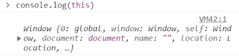

**範例說明：打印出外圍全域物件 window**

##### ◆ 單純調用函式 function

```javascript
const calcAge = function (birthday) {
  console.log(2037 - birthday);
  console.log(this);
};
calcAge(1993);
```

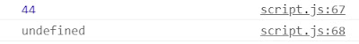

**範例說明：打印出 undefined**
因為函式沒有被附加到任何對象上，所以也就沒有我們說的調用者，於是會打印出 undefined，但如果在非嚴格模式下，就會是最一開始的範例打印出外圍全域物件 window

##### ◆ 箭頭函式 Arrow function

```javascript
const calcAgeArrow = (birthday) => {
  console.log(2037 - birthday);
  console.log(this);
};
calcAgeArrow(1993);
```

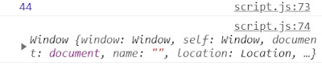

**範例說明：打印出 window**
因為箭頭函示沒有自己 this 變數，所以會指向父作用域的 this 變數，也就是全域範疇的 this─window，也就是最一開始的範例打印出外圍全域物件 window。

**暫停一下：**
先讓我們暫時來比較並釐清上面兩個函式方法，單純調用函式有自己的 this 變數，只是因為單純調用沒有附載在任何對象下，所以自然 this 的值就是 undefined，而箭頭函式則是壓根沒有 this 變數，所以才指向父範疇的 this 變數。在下一篇筆記針對一般函式與箭頭函式的筆記中，也會說明沒有 this 變數對箭頭函式有什麼影響。

#### 調用對象影響 this 變數變動範例

```javascript
const emily = {
  year: 1993,
  calcAge: function () {
    console.log(this);
    console.log(2037 - this.year);
  },
};
emily.calcAge();
```

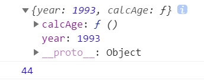

this 打印出 emily 整個物件，而這也就是先前說的，this 的值會指向該調用者的所有屬性。

\*在這裡要注意的是，this 之所以會打印出 emily 整個物件，不是因為 this 就在 emily 物件裡面，而是因為最後一行，是 emily 調用了 calcAge()，所以 this 的值才指向 emily。好像有點迷糊嗎？讓我們繼續看看下面的例子。

```javascript
//我們先聲明一個新物件
const peter = {
  year: 2017,
};
//將上面emily物件中的calcAge方法複製進peter的物件中
peter.calcAge = emily.calcAge;
```

現在 peter 跟 emily 都有了 calcAge 方法，而這個複製的動作也稱為方法借用(method borrowing)，讓我們省去重複寫程式碼的麻煩。

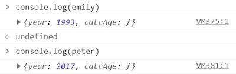

現在讓我們看看 peter.calcAge()會印出什麼

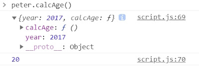

打印出 20，也就是正確的運算 2037-2017。從這裡我們可以更清楚了解，所謂 this 不是單純指向該對象，而是調用該方法的對象，是什麼意思。以及為什麼我們反覆重複這句話。因為很重要!!!

1. 雖然 calcAge 一開始是被寫在 emily 裡面，但他的 this 變數值，仍指向調用他的 peter
2. this 值是會變動的，也就為什麼造成上面第一點的變化，原本的 this 值是 emily、現在是 peter 調用該 calcAge 方法，所以 this 值變為 peter。

**再進一步演示，如果我們把 function 拿出來又會發生什麼變化。**

```javascript
const f = emily.calcAge;
console.log(f);
f();
```

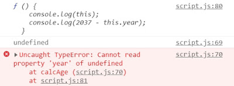
報錯！因為現在的 func f 變成單純調用函式，沒有依附在任何對象上，所以原本的 this 變數現在變成 undefined 了。

## 📌 常規函式與箭頭函式的 THIS 變數陷阱<a id="jump_4"></a>

#### ◆ 陷阱範例 1

```javascript
const emily = {
  firstName: "emily",
  year: 1993,
  calcAge: function () {
    console.log(this);
    console.log(2037 - this.year);
  },
  greet: () => {
    console.log(`hey ${this.firstName}`);
    console.log(this);
  },
};
emily.greet();
```

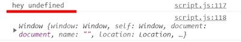

greet 是箭頭函式，而箭頭函式沒有自己的 this 變數，他會去抓取父層範疇的 this 變數，而在這個例子裡，父層範疇則屬於 global，而 global 的 this 變數為 window 物件。於是 this.firstName 就等於 window.firstName，物件中找不到這個屬性，自然就回傳了未定義 undefined。

而上述例子中，如果使用的是 var，那結果就又更危險了。因為記得嗎？**var 聲明變數會在 window 中創建屬性**。

`如果我們在上述例子中加上一行var firstName = 'Mandy'`

```javascript
//全域範疇加上var firstName 變數
var firstName = "Mandy";
const emily = {
  firstName: "emily",
  year: 1993,
  calcAge: function () {
    console.log(this);
    console.log(2037 - this.year);
  },
  greet: () => {
    console.log(`hey ${this.firstName}`);
    console.log(this);
  },
};

emily.greet();
```

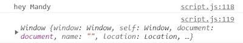

此時會印出 hey Mandy，而原因是因為在第一行 var firstName = 'Mandy'聲明中，**已經在 window 屬性裡添加了 firstName = 'Mandy'的屬性**，所以在這樣的情形下，window 已經有 firstName 這個屬性了。(如下圖)

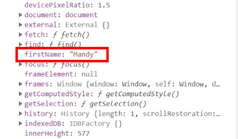

而與上面例子相同的，當箭頭函式的程式碼執行 this.firstName，this 變數會去指向父層範疇的 this 變數，等同於執行了 window.firstName，而這次就找得到稍早建立的 firstName，所以才印出 Mandy。

很合理，但又很鬧事吧？所以還是珍惜生命不用 var 的好，另外，盡量避免在方法中使用箭頭函式，選用常規函式也是避免錯誤的好方法。

#### ◆ 陷阱範例 2

```javascript
const emily = {
  firstName: "emily",
  year: 1993,
  calcAge: function () {
    console.log(this);
    console.log(2037 - this.year);
    const isMillenial = function () {
      console.log(this);
      console.log(this.year >= 1981 && this.year <= 1996);
    };
    isMillenial();
  },
  greet: () => {
    console.log(`hey ${this.firstName}`);
    console.log(this);
  },
};

emily.calcAge();
```

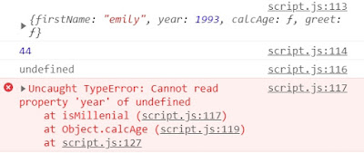

在這邊，我們看見 isMillenial 內的 this 變數是 undefined，為什麼？
因為單純調用函式的 this 變數就是 undefined，就算他在方法內部也一樣。因為 isMillenial()就是簡單調用函式，並沒有附載任何調用對象。

早期有人認為這是 JavaScript 的錯誤，但其實這樣深入理解後，我們就知道 this 變數一直是依循他原訂的規則在工作。因為 this 變數的被調用的方法之一 ─ 常規函式調用的 this 就是 undefined，完全符合規則。

**＃ES6 之前 解決方案 1**
在 ES6 之前，這個情形有個有趣的解決方法，就是先把想要的 this 變數存成 self，請看範例(直接擷上例中的 calcAge 函式片段)

```javascript
//Solution 1
const emily = {
  calcAge: function () {
    console.log(this);
    console.log(2037 - this.year);
    //將this變數存放起來
    const self = this;
    const isMillenial = function () {
      console.log(self);
      console.log(self.year >= 1981 && self.year <= 1996);
      //console.log(this.year >= 1981 && this.year <= 1996)
    };
    isMillenial();
  },
};

emily.calaAge();
```

先把 calcAge 的 this 變數存成 self，所以當 emily 調用 calaAge()方法時，func calaAge 中的 this 則是 emily 整個物件，現在已經被存進 self 變數中，而當 func isMillenial 被調用時，因為範疇鏈的關係，會向外去尋找 self 變數，也就找到了我們是先存放好的 self 變數，也就是 emily 整個物件。

而以上的方法，也被稱為借值(dept)

**＃ES6 之後 解決方案 2 現行解決方法**
想要透過範疇鏈去取得父層範疇的 this 變數，你有猜到是什麼了嗎？沒錯就是**箭頭函式**！

```javascript
//Solution 2
const emily = {
  calcAge: function () {
    console.log(this);
    console.log(2037 - this.year);
    //用箭頭函式直接取得父層的this變數特性
    const isMillenial = () => {
      console.log(this);
      console.log(this.year >= 1981 && this.year <= 1996);
    };
    isMillenial();
  },
};

emily.calaAge();
```

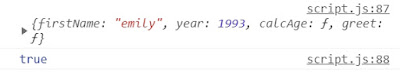

反正要取得父層範疇的 this 值，乾脆就使用箭頭函式來滿足這個願望，而實際上程式碼也簡潔許多。

以上，其實在清楚了解 this 變數的調用方法後，就能依不同的情形來搭配不同的函式編寫方式，其實 this 變數一點都不 tricky，相反的他其實很守規矩又很忠心呢~

## 📌 再多一點 take away：參數變數 argument keyword<a id="jump_5"></a>

在先前執行環境的變數環境中，我們有談到參數 arguments，而這也是函式可以訪問到的變數之一，所以在 this 筆記的最後，想附帶談一談參數 arguments。

就像 this 變數一樣，參數 arguments 變數也只有在常規函式中可以使用，讓我們來看看範例。

#### ◆ 常規函式

```javascript
const addExpr = function (a, b) {
  console.log(arguments);
  return a + b;
};
addExpr(2, 5);
```

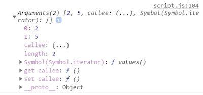

從 console.log arguments 變數中，我們可以看到我們所傳入的參數，而其實函式比我們所想的函能接受更多的參數，例如：

```javascript
const addExpr = function (a, b) {
  console.log(arguments);
  return a + b;
};
addExpr(2, 5, 5, 6, 7, 8);
```

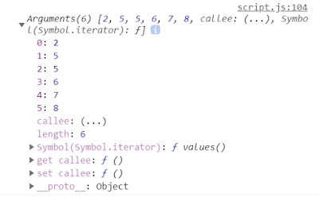

搭啷~ 雖然我們從來都只有在函式內傳入相應的參數，但其實添加更多的參數是完全合法的，而且我們還「可以」應用所傳入的這些參數！例如使用 loop 循環，遍歷這些數值，讓數字相加等應用。

#### ◆ 箭頭函式

```javascript
const addExpr = (a, b) => {
  console.log(arguments);
  return a + b;
};
addExpr(2, 5);
```

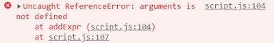

而在箭頭函式中，我們得到了 undefined。因為參數關鍵字(arguments)只存在常規函式中(函式陳述句、函式表示式皆同)，只有在箭頭函式中沒有。

但在現行 JavaScript 中，參數關鍵字(arguments)已經沒有以前重要了，但我們還是可以知道有這個變數的存在。而我們也就更知道了常規函式與箭頭函式間的區別，也就更知道在什麼時機選用什麼方法。

以上，有沒有覺得 this 變數好像也沒這麼 tricky 了呢？
其實 this 就是一個很死心踏地的忠臣耶。

**<center>JavaScript 深度旅遊系列<center>**

[JS#1：JavaScript 運作原理 ─ 深入研究之前，先了解全局](https://emilycodeee.github.io/JS-1/)
[JS#2：JavaScript 引擎與 JavaScript 的運行環境 ─ 什麼？JavaScript 早就不只是直譯式語言了？！](https://emilycodeee.github.io/JS-2/)
[JS#3：JavaScript 的執行原理，Javascript 的執行環境 (Execution context) 與執行堆疊 (Call Stack)](https://emilycodeee.github.io/JS-3/)
[JS#4：Javascript 的範疇/作用域（Scope）與範疇鏈 （Scope Chain）變數查找（variable lookup）](https://emilycodeee.github.io/JS-4/)
[JS#5：優先認可 變數提升 Hoisting？暫時死區(Temporal Dead Zone) ─ const、let、var 的小祕密](https://emilycodeee.github.io/JS-5/)
